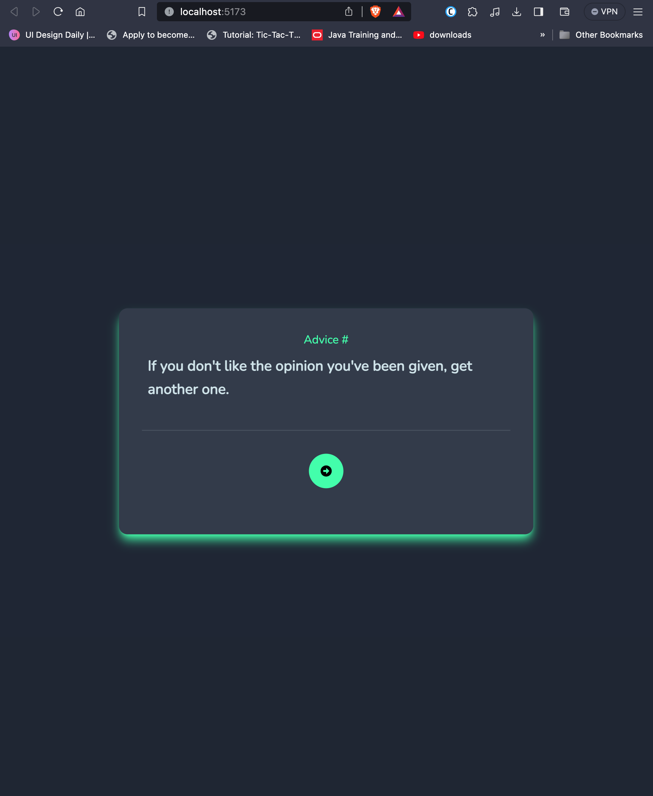

# Frontend Mentor - Advice generator app solution

This is a solution to the [Advice generator app challenge on Frontend Mentor](https://www.frontendmentor.io/challenges/advice-generator-app-QdUG-13db). Frontend Mentor challenges help you improve your coding skills by building realistic projects.

## Table of contents

- [Overview](#overview)
  - [The challenge](#the-challenge)
  - [Screenshot](#screenshot)
  - [Links](#links)
- [My process](#my-process)
  - [Built with](#built-with)
  - [What I learned](#what-i-learned)
  - [Continued development](#continued-development)
  - [Useful resources](#useful-resources)
- [Author](#author)


## Overview

### The challenge

Users should be able to:

- View the optimal layout for the app depending on their device's screen size
- See hover states for all interactive elements on the page
- Generate a new piece of advice by clicking the dice icon

### Screenshot



### Links

- Solution URL: [Find solution URL here](https://www.frontendmentor.io/solutions/responsive-advice-generator-page-using-react-and-tailwind-css-qkjQgtAIqj)
- Live Site URL: [Find live site URL here](https://advice-syt-project.netlify.app/)

## My process

### Built with

- Vite
- Tailwind CSS
- CSS Grid
- Mobile-first workflow
- [React](https://reactjs.org/) - JS library
- React icons

### What I learned

One of the major things I learned while taking on this challenge was the loading functonality that tells the user something is happening under the hood, i.e when when for the promise made the async function when calling an API.

Here is how I implemented the loading:

```js
const fetchAdvice = async () => {
  setIsLoading(true);
  const res = await fetch(url);
  const data = await res.json();
  setAdvice(data.slip);
  setIsLoading(false);
};
```

Styling for the loading component

```jsx
const LoadingComponent = () => {
  return (
    <div className="flex md:gap-4 gap-2 items-center justify-center">
      <div className="text-title">
        <FaSpinner className="animate-spin text-4xl" />
      </div>
      <h1 className="text-title font-semibold text-xl">
        Let's ask Eleanor Roosevelt
      </h1>
    </div>
  );
};
```

### Continued development

One of the areas I feel I need to improve on, in the future is handling exceptions that may be generated from an unfullfilled promise.

### Useful resources

- [Tailwind Docs](https://tailwindcss.com/docs/installation) - This helped me for desiging my loading animation reason. I really liked the design and will use it going forward.
- [React API interaction](https://www.youtube.com/watch?v=00lxm_doFYw) - This is an amazing video which helped me understand how to implement the loading functionality in react among other things. I'd recommend it to anyone still learning this concept.

## Author

- Website - [Add your name here](https://www.your-site.com)
- Frontend Mentor - [@yourusername](https://www.frontendmentor.io/profile/yourusername)
- Twitter - [@yourusername](https://www.twitter.com/yourusername)
